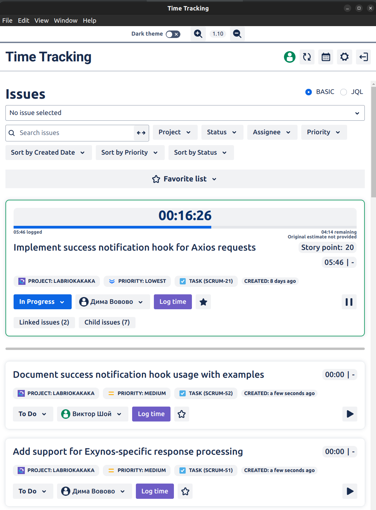
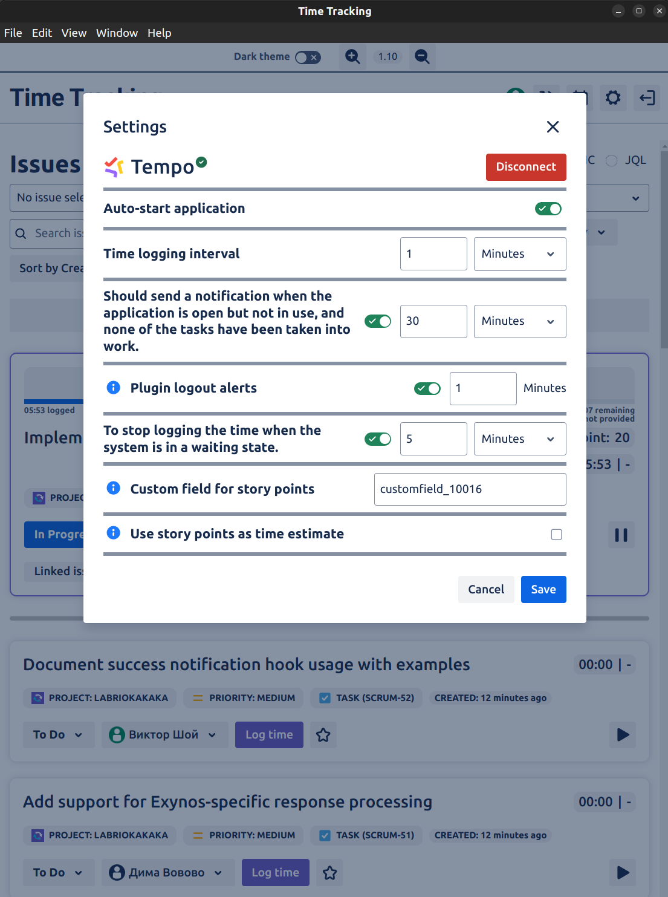

# Time Tracker for Jira

Time Tracker for Jira is a desktop application designed to improve time tracking for Jira users. Unlike Jira, where tracking time can be cumbersome, our app provides a streamlined experience with added features such as Timesheets, time tracking for multiple tasks, and an integrated Tempo plugin. The app is ideal for Junior and Middle developers who need to track time quickly without opening Jira constantly.

## Key Features

- **Timesheet**: View your work logs by date, both from Jira and Tempo.
- **Track Time Efficiently**: Easily start and stop time tracking directly within the app. No need to worry about leaving the app open or forgetting about it.
- **Task Status Management**: Change task status before and after tracking time.
- **Assign/Unassign Tasks**: Switch task assignee during tracking.
- **Log Time on Other Tasks**: Log time on tasks assigned to others for collaborative work.
- **Worklog Management**: Add, edit, and delete worklogs easily.
- **Tempo Integration**: Seamlessly integrate with the Tempo plugin.
- **Favorites**: Create groups of important tasks for easy access.
- **Linked Issues**: Dive deep into linked issues for better tracking.
- **Child Tasks**: View and manage child tasks linked to a parent task.
- **Due Dates, Time Tracking, and Story Points**: Support for due dates, time tracking (d,h,s), and Story Points (use Story Points as hours).

## Target Audience

This application is perfect for Junior and Middle developers who need to track their time efficiently. It's designed for individuals who need to start tasks and track time without constantly navigating Jira. The only thing missing at the moment is task descriptions and comments, but these features are coming soon.

## Future Updates

- Task descriptions and comments
- Improved UI/UX for better accessibility

